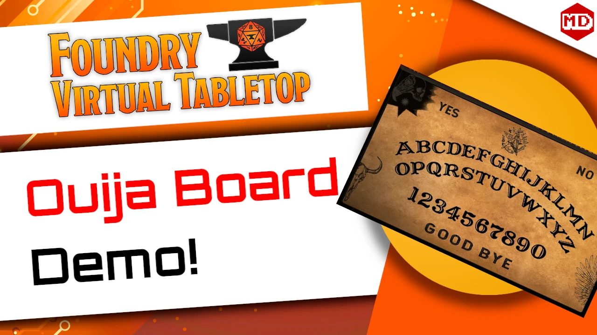

# Ouija Board for Sequencer

This module let you simulate a Ouija Board for your players.

## Demonstration

[](https://youtu.be/bOmA8z9-R-o)

[](https://buymeacoffee.com/mestredigital) [](https://mestredigital.online/pages/projetos-en)

# How to Install

1. Go to modules and use the link: 

```js
https://raw.githubusercontent.com/brunocalado/ouija-board-for-sequencer/main/module.json
```


## Instructions

Open **Configure Settings → Ouija Board for Sequencer → Open Instructions** for a
tabbed guide covering setup, the control dialog, the coordinate map, and labels & sound.

# Community

- If you want to share an art you made and have permission to distribute [click here](https://github.com/brunocalado/ouija-board-for-sequencer/issues)
- You can report bugs, request features at [issues](https://github.com/brunocalado/ouija-board-for-sequencer/issues)

# Acknowledges

- Piloto de Mouse (Heber Maia)
- Cefas, GURPS and CSS guy.
- Erich Matos Viegas
- Matheus Moreno Mota, half man, half capyvara
- @Wasp#2005 - https://github.com/fantasycalendar/FoundryVTT-Sequencer
- https://github.com/RebelMage
- https://github.com/KenGitsIt

# Changelog

You can check changes at [CHANGELOG](CHANGELOG.md)

# License

- Sound: https://99sounds.org/license/
- Image: https://pixabay.com/service/license/
- Designer: Matheus Moreno Mota
- Code: [LICENSE](LICENSE)